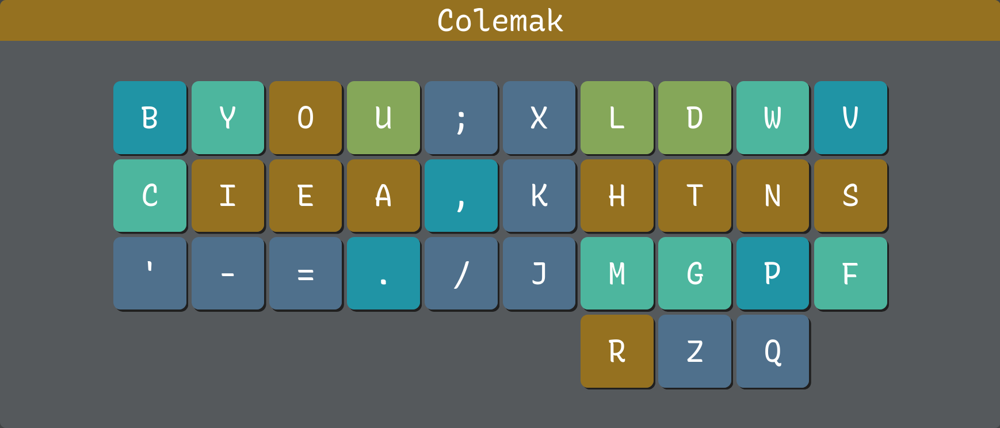
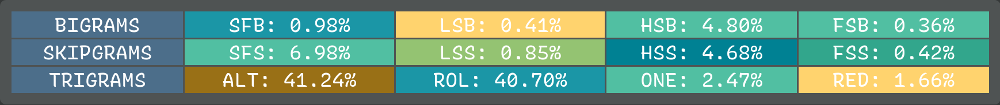
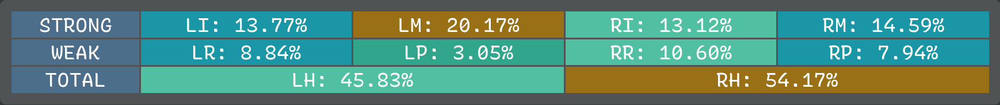
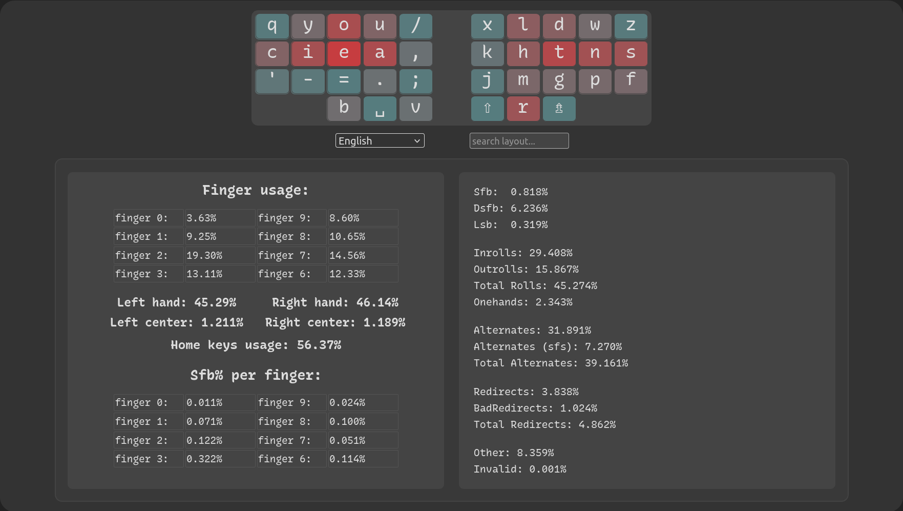
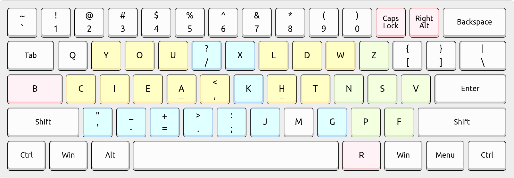

# Enthium - Engrammer meets Hands Down Promethium

This adaptation of the [Engrammer] and [Hands Down Promethium] keyboard layouts
improves on the latter's performance in keyboard layout analyzers (see below)
by mirroring it horizontally to restore familiarity with [Arno's Engram 2.0]
layout (CIEA on left hand's home row; PF is swapped with WV to be like Engram)
and the [Dvorak] layout (HTNS on right hand's home row), and by optimizing the
placement of punctuation for programming in the spirit of the Engrammer layout.

Notably, the differences between Engram/mer and Enthium are so minimal that one
might switch to it completely with about 6 hours of practice, spread over 2-3
days (start Friday and use weekend), to unlock all letters in [KeyBr] training.

[Hands Down Promethium]: https://reddit.com/r/KeyboardLayouts/comments/1g66ivi
[Arno's Engram 2.0]:     https://engram.dev
[Engrammer]:             https://github.com/sunaku/engrammer
[Dvorak]:                https://www.dvzine.org
[KeyBr]:                 https://github.com/aradzie/keybr.com#readme

## Layout

      q y o u ; x l d w z
    b c i e a , k h t n s v
      ' - = . / j m g p f
                r

<!-- vim-markdown-toc GFM -->

* [Rationale](#rationale)
  * [Deviation: PF and WV](#deviation-pf-and-wv)
  * [Deviation: B and V](#deviation-b-and-v)
* [Performance](#performance)
  * [Cyanophage analyzer](#cyanophage-analyzer)
  * [KeySolve analyzer](#keysolve-analyzer)
  * [Oxey's analyzer](#oxeys-analyzer)
  * [Comparison](#comparison)
* [Installation](#installation)
  * [Linux setup](#linux-setup)
  * [MacOS setup](#macos-setup)
* [License](#license)

<!-- vim-markdown-toc -->

## Rationale

* Q and Z are split apart onto different hands for balance and symmetry.

* Apostrophe is away (on a different finger entirely) from YOU and I so
  it can be typed without same-finger bigrams such as `you'd` and `I'd`.

* Cluster minus and equals for intuitive zoom in/out shortcuts with Ctrl.

* Cluster comma and semicolon for prev/next jumping in Vim for f/F/t/T.
  This also mirrors the relative ordering of H and L on the right hand.

* Cluster period and slash for `./` and `../` filesystem path navigation,
  raking down vertically for `</` closing tags in HTML and XML documents,
  and easy access to forward slash and question mark for Vim text search.

* Although period and comma are backwards in the sense of their shifted
  symbols `>` and `<`, their arrangement reduces lateral stretch bigrams
  and also clusters `>` with minus and equals for `->` and `=>` arrows.

### Deviation: PF and WV

PF is swapped with WV in order to address the following inconveniences:

* WN is a stair-step ascension same-finger bigram that I wished I could rake down instead
* DW (2u skip) is not as convenient for Vim as it was in Engram (which puts them adjacent)
* FG (2u skip) is not as convenient for shell background jobs (`bg`, `fg`) as it was in Engram
* SW (half scissor) feels a little bit weaker curling inward than reaching up (as in Engram)
* FF (e.g. "stu*ff*") is a little bit of a chore for the pinky finger to tap twice in the upper row

I really didn't want to deviate from the canonical Hands Down Promethium layout
(this "Enthium" derivative was just supposed to be a simple horizontal mirror,
plus some rearranged punctuation marks) so I reluctantly went to the keyboard
layout analyzer playgrounds to see how bad it would be to swap PF with WV... and
to my complete surprise, this change hardly affected the layout's performance:

* Oxey's analyzer showed no changes at all in the stats!
* KeySolve analyzer showed an increase in FSB from 0.14% to 0.37% but the other
  stats improved: FSS reduced from 0.82% to 0.48%, HSB reduced from 6.05% to
  5.64%, and HSS reduced from 5.97% to 5.50%; everything else was identical.
* Cyanophage analyzer's Total Word Effort increased from 730.9 to 735.9 but all
  other stats remained the same!

I'm _so glad_ this experiment worked out because it makes the layout a lot more
comfortable for me in practice and it would also further reduce the barrier to
entry for others seeking to switch over to Enthium from the Engrammer layout. :)

### Deviation: B and V

B and V are rotated out from the upper row to the home row lateral in order to
avoid reaching up with short pinky fingers or those [weakened by convention](
https://reddit.com/r/KeyboardLayouts/comments/1fy8nve/_/lqulnww/ ).  Their keys
are reassigned to the least frequent letters in the English language: Q and Z.

In the Cyanophage analyzer, this change reduces Pinky/Ring Scissors from 0.49%
down to 0.35% (a massive drop!) and Skip Bigrams (2u) from 0.30% down to 0.29%.
The other analyzers don't fully comprehend the placement of lateral pinky keys,
as explained in the note at the top of each analyzer's respective subheading,
but Oxey's analyzer reports a notable reduction in SFBs from 0.829% to 0.818%.

## Performance

### [Cyanophage analyzer][cNT]

> **NOTE:** This analyzer currently has a limitation where it only supports
> placing a letter on the left thumb and not on the right, so this layout is
> mirrored horizontally for analysis.  Mirroring doesn't affect the results.

Overall stats:
* Total Word Effort: 748.5
* Effort:            430.25

Finger usage:
* Same Finger Bigrams: 0.55%
* Skip Bigrams (2u):   0.29%
* Lat Stretch Bigrams: 0.20%
* Pinky/Ring Scissors: 0.35%

Trigram stats:
* alt:             37.47%
* bigram roll in:  28.99%
* bigram roll out: 14.71%
* other:           9.07%
* alt sfs:         5.08%
* redirect:        1.94%
* roll in:         1.36%
* weak redirect:   1.24%
* roll out:        0.13%

### [KeySolve analyzer](https://clemenpine.github.io/keysolve-web/)

> **NOTE:** This analyzer currently doesn't support placing letters on lateral
> home row pinky keys such as the traditional CapsLock key and the apostrophe,
> so these results may not be accurate.  For instance, the SFB percentage here
> assumes that R B V are all typed by the thumb whereas they're all really on
> different fingers: with R on right thumb, B on left pinky, V on right pinky.

Overall stats:

    BIGRAMS     SFB: 0.98%      LSB: 0.41%      HSB: 4.82%      FSB: 0.36%
    SKIPGRAMS   SFS: 6.98%      LSS: 0.85%      HSS: 4.70%      FSS: 0.42%
    TRIGRAMS    ALT: 41.24%     ROL: 40.70%     ONE: 2.47%      RED: 1.66%

Finger usage:

    LEFT        LI: 13.77%      LM: 20.17%      LR: 8.84%       LP: 3.05%
    RIGHT       RI: 13.12%      RM: 14.59%      RR: 10.60%      RP: 7.94%
    TOTAL               LH: 45.83%                      RH: 54.17%

Custom source for copy/paste:

    q y o u ; x l d w z
    c i e a , k h t n s
    ' - = . / j m g p f
    r b v

### [Oxey's analyzer](https://oxey.dev/playground/index.html)

> **NOTE:** This analyzer currently doesn't support placing letters on lateral
> home row pinky keys such as the traditional CapsLock key and the apostrophe,
> so these results may not be accurate.  For instance, the SFB percentage here
> assumes that B and V are typed by the left thumb whereas they're really on
> different fingers: with B typed by the left pinky and V by the right pinky.

Overall stats:
* Sfb:              0.818%
* Dsfb:             6.236%
* Lsb:              0.319%
* Inrolls:          29.408%
* Outrolls:         15.867%
* Total Rolls:      45.274%
* Onehands:         2.343%
* Alternates:       31.891%
* Alternates (sfs): 7.270%
* Total Alternates: 39.161%
* Redirects:        3.838%
* BadRedirects:     1.024%
* Total Redirects:  4.862%
* Other:            8.359%
* Invalid:          0.001%

Finger usage:

    finger 0:   3.63%   finger 9:       8.60% 
    finger 1:   9.25%   finger 8:       10.65%
    finger 2:   19.30%  finger 7:       14.56%
    finger 3:   13.11%  finger 6:       12.33%

    Left hand:   45.29% Right hand:     46.14%
    Left center: 1.211% Right center:   1.189%

    Home keys usage: 56.37%

Sfb% per finger:

    finger 0:   0.011%  finger 9:       0.024%
    finger 1:   0.071%  finger 8:       0.100%
    finger 2:   0.122%  finger 7:       0.051%
    finger 3:   0.322%  finger 6:       0.114%

### Comparison

> **NOTE:** Oxey's analyzer currently doesn't support placing letters on lateral
> home row pinky keys such as the traditional CapsLock key and the apostrophe,
> so these results may not be accurate.  For instance, the SFB percentage here
> assumes that B and V are typed by the left thumb whereas they're really on
> different fingers: with B typed by the left pinky and V by the right pinky.
> Instead, consider the [Cyanophage analyzer's results](#cyanophage-analyzer)
> because it takes into account lateral pinky keys and one thumb letter key.

The [keyboard layout community][rKL] commonly recommends [Pascal Getreuer's
guide and comparison table][PGt] as a starting point for layout exploration,
and you'll see that Enthium is among the best (statistically) layouts there:

* 0.818% SFBs -- wins 🥈 second place; surpassed by Focal
* 0.319% LSBs -- wins 🥇 first place; beats the entire table!
* 45.274% rolls -- beats Nerps, Gallium, MTGAP, Graphite, Dvorak, Halmak, etc.
* 4.862% redirects -- beats MTGAP, Sturdy, Recurva, APTv3, Canary, Colemak, etc.
* 2.80% pinky off _excluding_ lateral -- beats Graphite, Canary, Gallium, MTGAP, etc.
  * `Q` (0.10%) + `'` (0.48%) + `Z` (0.10%) + `F` (2.12%)
* 5.35% pinky off _including_ lateral -- beats Engram, Halmak; surpassed by the rest
  * `Q` (0.10%) + `'` (0.48%) + `Z` (0.10%) + `F` (2.12%) + `B` (1.49%) + `V` (1.06%)

[rKL]: https://www.reddit.com/r/KeyboardLayouts/
[PGt]: https://getreuer.info/posts/keyboards/alt-layouts/index.html#which-alt-keyboard-layout-should-i-learn

For completeness, I've tabulated all [statistics for this and related layouts]( stats/ ):

[cNT]: https://cyanophage.github.io/playground.html?layout=zwdlx%3Buoyq%5Csnthk%2Caeicbfpgmj%2F.%3D-%27vr&mode=ergo&lan=english
[cPM]: https://cyanophage.github.io/playground.html?layout=fpdlx%3Buoybzsnthk%2Caeicqvwgmj-.%27%3D%2F%5Cr&mode=ergo&lan=english
[cNG]: https://cyanophage.github.io/playground.html?layout=byou%27%3Bldwvzciea%2C.htsnqgxjk-%2Frmfp%5C%5E&mode=ergo&lan=english
[cDV]: https://cyanophage.github.io/playground.html?layout=%27%2C.pyfgcrl%2Faoeuidhtns-%3Bqjkxbmwvz%5C%5E&mode=ergo&lan=english
[cCD]: https://cyanophage.github.io/playground.html?layout=qwfpbjluy%3B-arstgmneio%27zxcdvkh%2C.%2F%5C%5E&mode=ergo&lan=english

| Analyzer   | Category  | Statistic           | [Enthium][cNT] | [Promethium][cPM] | [Engrammer][cNG] | [Dvorak][cDV] | [Colemak-DH][cCD] |
| ---------- | --------- | ------------------- | -------------- | ----------------- | ---------------- | ------------- | ----------------- |
| Oxey's     | Bigrams   | SFB                 | 0.818%         | 0.868%            | 1.511%           | 2.779%        | 1.367%            |
| Oxey's     | Bigrams   | DSFB                | 6.236%         | 6.761%            | 7.620%           | 6.979%        | 8.767%            |
| Oxey's     | Bigrams   | LSB                 | 0.319%         | 0.404%            | 0.671%           | 1.255%        | 1.975%            |
| Oxey's     | Trigrams  | Inrolls             | 29.408%        | 29.333%           | 28.273%          | 23.820%       | 25.173%           |
| Oxey's     | Trigrams  | Outrolls            | 15.867%        | 14.526%           | 14.050%          | 15.104%       | 20.940%           |
| Oxey's     | Trigrams  | Total Rolls         | 45.274%        | 43.858%           | 42.323%          | 38.924%       | 46.113%           |
| Oxey's     | Trigrams  | Onehands            | 2.343%         | 2.189%            | 2.146%           | 0.624%        | 2.484%            |
| Oxey's     | Trigrams  | Alternates          | 31.891%        | 33.770%           | 32.483%          | 35.769%       | 22.913%           |
| Oxey's     | Trigrams  | Alternates (SFS)    | 7.270%         | 8.205%            | 8.752%           | 8.787%        | 7.461%            |
| Oxey's     | Trigrams  | Total Alternates    | 39.161%        | 41.974%           | 41.235%          | 44.556%       | 30.375%           |
| Oxey's     | Trigrams  | Redirects           | 3.838%         | 2.273%            | 3.103%           | 2.639%        | 9.081%            |
| Oxey's     | Trigrams  | BadRedirects        | 1.024%         | 1.236%            | 1.386%           | 0.818%        | 1.498%            |
| Oxey's     | Trigrams  | Total Redirects     | 4.862%         | 3.509%            | 4.489%           | 3.458%        | 10.579%           |
| Oxey's     | Trigrams  | Other               | 8.359%         | 8.468%            | 9.806%           | 12.437%       | 9.202%            |
| Oxey's     | Trigrams  | Invalid             | 0.001%         | 0.001%            | 0.001%           | 0.001%        | 1.248%            |
| Oxey's     | Usage     | Finger 0            | 3.63%          | 9.56%             | 6.58%            | 8.50%         | 8.12%             |
| Oxey's     | Usage     | Finger 1            | 9.25%          | 10.65%            | 9.21%            | 8.72%         | 8.04%             |
| Oxey's     | Usage     | Finger 2            | 19.30%         | 14.56%            | 19.47%           | 12.99%        | 11.55%            |
| Oxey's     | Usage     | Finger 3            | 13.11%         | 12.33%            | 13.35%           | 14.95%        | 19.19%            |
| Oxey's     | Usage     | Finger 6            | 12.33%         | 13.28%            | 16.04%           | 16.33%        | 18.88%            |
| Oxey's     | Usage     | Finger 7            | 14.56%         | 19.77%            | 14.93%           | 13.73%        | 15.60%            |
| Oxey's     | Usage     | Finger 8            | 10.65%         | 9.01%             | 10.31%           | 13.84%        | 10.11%            |
| Oxey's     | Usage     | Finger 9            | 8.60%          | 4.62%             | 9.90%            | 10.59%        | 7.77%             |
| Oxey's     | Usage     | Left hand           | 45.29%         | 47.10%            | 48.61%           | 45.16%        | 46.89%            |
| Oxey's     | Usage     | Right hand          | 46.14%         | 46.68%            | 51.18%           | 54.49%        | 52.36%            |
| Oxey's     | Usage     | Left center         | 1.211%         | 1.189%            | 1.765%           | 9.208%        | 4.592%            |
| Oxey's     | Usage     | Right center        | 1.189%         | 1.384%            | 1.294%           | 7.257%        | 3.393%            |
| Oxey's     | Usage     | Home keys           | 56.37%         | 56.37%            | 56.37%           | 56.70%        | 62.31%            |
| Oxey's     | SFB%      | Finger 0            | 0.011%         | 0.028%            | 0.012%           | 0.020%        | 0.041%            |
| Oxey's     | SFB%      | Finger 1            | 0.071%         | 0.100%            | 0.089%           | 0.028%        | 0.047%            |
| Oxey's     | SFB%      | Finger 2            | 0.122%         | 0.051%            | 0.230%           | 0.253%        | 0.186%            |
| Oxey's     | SFB%      | Finger 3            | 0.322%         | 0.114%            | 0.591%           | 1.075%        | 0.219%            |
| Oxey's     | SFB%      | Finger 6            | 0.114%         | 0.339%            | 0.380%           | 0.433%        | 0.388%            |
| Oxey's     | SFB%      | Finger 7            | 0.051%         | 0.185%            | 0.053%           | 0.494%        | 0.341%            |
| Oxey's     | SFB%      | Finger 8            | 0.100%         | 0.040%            | 0.098%           | 0.256%        | 0.137%            |
| Oxey's     | SFB%      | Finger 9            | 0.024%         | 0.011%            | 0.058%           | 0.220%        | 0.007%            |
| KeySolve   | Bigrams   | SFB                 | 0.98%          | 0.94%             | 1.56%            | 2.62%         | 1.49%             |
| KeySolve   | Bigrams   | LSB                 | 0.41%          | 0.45%             | 0.98%            | 1.17%         | 2.21%             |
| KeySolve   | Bigrams   | HSB                 | 4.82%          | 6.04%             | 3.02%            | 6.11%         | 5.93%             |
| KeySolve   | Bigrams   | FSB                 | 0.36%          | 0.26%             | 0.30%            | 0.14%         | 0.37%             |
| KeySolve   | Skipgrams | SFS                 | 6.98%          | 7.02%             | 7.50%            | 7.00%         | 7.95%             |
| KeySolve   | Skipgrams | LSS                 | 0.85%          | 0.93%             | 1.34%            | 4.48%         | 1.75%             |
| KeySolve   | Skipgrams | HSS                 | 4.70%          | 6.11%             | 6.91%            | 8.56%         | 6.49%             |
| KeySolve   | Skipgrams | FSS                 | 0.42%          | 0.78%             | 0.81%            | 1.22%         | 0.78%             |
| KeySolve   | Trigrams  | ALT                 | 41.24%         | 40.37%            | 39.59%           | 41.70%        | 27.58%            |
| KeySolve   | Trigrams  | ROL                 | 40.70%         | 40.84%            | 39.35%           | 37.19%        | 42.78%            |
| KeySolve   | Trigrams  | ONE                 | 2.47%          | 2.66%             | 2.65%            | 0.43%         | 2.45%             |
| KeySolve   | Trigrams  | RED                 | 1.66%          | 1.78%             | 2.65%            | 2.25%         | 6.74%             |
| KeySolve   | Usage     | LI                  | 13.77%         | 13.91%            | 13.91%           | 14.56%        | 18.82%            |
| KeySolve   | Usage     | LM                  | 20.17%         | 20.92%            | 20.30%           | 13.96%        | 10.18%            |
| KeySolve   | Usage     | LR                  | 8.84%          | 8.70%             | 8.83%            | 9.55%         | 7.83%             |
| KeySolve   | Usage     | LP                  | 3.05%          | 3.64%             | 5.72%            | 8.24%         | 7.63%             |
| KeySolve   | Usage     | RI                  | 13.12%         | 13.12%            | 16.52%           | 16.90%        | 20.00%            |
| KeySolve   | Usage     | RM                  | 14.59%         | 14.59%            | 15.03%           | 13.35%        | 16.91%            |
| KeySolve   | Usage     | RR                  | 10.60%         | 10.60%            | 10.08%           | 13.36%        | 10.46%            |
| KeySolve   | Usage     | RP                  | 7.94%          | 8.95%             | 9.47%            | 10.08%        | 8.16%             |
| KeySolve   | Total     | LH                  | 45.83%         | 47.18%            | 48.75%           | 46.31%        | 44.46%            |
| KeySolve   | Total     | RH                  | 54.17%         | 52.82%            | 51.25%           | 53.69%        | 55.54%            |
| Cyanophage | Summary   | Total Word Effort   | 748.5          | 732.3             | 899.8            | 1185.5        | 1048.2            |
| Cyanophage | Summary   | Effort              | 430.25         | 398.07            | 457.44           | 769.78        | 535.05            |
| Cyanophage | Bigrams   | Same Finger Bigrams | 0.55%          | 0.58%             | 0.99%            | 1.87%         | 0.91%             |
| Cyanophage | Bigrams   | Skip Bigrams (2u)   | 0.29%          | 0.36%             | 0.39%            | 0.45%         | 0.41%             |
| Cyanophage | Bigrams   | Lat Stretch Bigrams | 0.20%          | 0.24%             | 0.41%            | 0.80%         | 1.27%             |
| Cyanophage | Bigrams   | Pinky/Ring Scissors | 0.35%          | 0.42%             | 0.71%            | 0.40%         | 0.65%             |
| Cyanophage | Trigrams  | Alt                 | 37.47%         | 36.98%            | 35.62%           | 39.08%        | 25.43%            |
| Cyanophage | Trigrams  | Alt SFS             | 5.08%          | 5.27%             | 5.93%            | 5.85%         | 5.47%             |
| Cyanophage | Trigrams  | Roll in             | 1.36%          | 1.37%             | 1.82%            | 0.86%         | 1.50%             |
| Cyanophage | Trigrams  | Roll out            | 0.13%          | 0.11%             | 0.29%            | 0.27%         | 0.98%             |
| Cyanophage | Trigrams  | Bigram roll in      | 28.99%         | 29.18%            | 28.14%           | 23.51%        | 25.18%            |
| Cyanophage | Trigrams  | Bigram roll out     | 14.71%         | 14.56%            | 14.03%           | 15.14%        | 21.55%            |
| Cyanophage | Trigrams  | Redirect            | 1.94%          | 2.03%             | 3.05%            | 2.57%         | 9.22%             |
| Cyanophage | Trigrams  | Weak redirect       | 1.24%          | 1.30%             | 1.40%            | 0.28%         | 1.52%             |
| Cyanophage | Trigrams  | Other               | 9.07%          | 9.20%             | 9.72%            | 12.44%        | 9.17%             |

## Installation

### Linux setup

>*Legend:* QWERTY=white; Engram=gold; Enthium=blue/green; Quirks=pink.
>

Install:

    cd linux/
    sudo make install
    echo Now restart your graphical session.

Activate:

    setxkbmap -layout us    -variant enthium         # one layout; no switch
    setxkbmap -layout us,us -variant enthium,basic   # dual layout switching

Repair (e.g. whenever a system-wide XKB package upgrade reverts installation):

    cd linux/
    sudo make reinstall
    echo Now restart your graphical session.

Uninstall:

    cd linux/
    sudo make uninstall
    echo Now restart your graphical session.

### MacOS setup

#### Installation

In order to use the layout on MacOS, you'll need to install [Karabiner-Elements](https://karabiner-elements.pqrs.org/).

You can install it via [Homebrew](https://brew.sh/):

    brew install --cask karabiner-elements

Or download it from the main [Karabiner-Elements website](https://karabiner-elements.pqrs.org/).

When downloaded, simply follow the instructions of the [installation guide](https://karabiner-elements.pqrs.org/docs/getting-started/installation/).

#### Complex modification

Once everything is installed, you can use the [complex modification feature](https://karabiner-elements.pqrs.org/docs/manual/configuration/configure-complex-modifications/) to remap your keys.

The enthium complex modification is available [here](https://ke-complex-modifications.pqrs.org/?q=enthium).

To get back to the basic layout, you can simply remove the enthium complex modification.

#### Uninstallation

* Brew : `brew uninstall --cask karabiner-elements`
* Manual : Remove the `Karabiner-Elements.app` from your Applications folder.

## License

Released under the same terms as [Arno's Engram 2.0] keyboard layout's sources:

> MIT License
>
> Copyright 2022 Ricard Figueroa <https://github.com/rfiga>  
> Copyright 2021 Suraj Kurapati <https://github.com/sunaku>  
> Copyright 2021 Arno Klein <https://github.com/binarybottle>  
>
> Permission is hereby granted, free of charge, to any person obtaining a copy
> of this software and associated documentation files (the "Software"), to deal
> in the Software without restriction, including without limitation the rights
> to use, copy, modify, merge, publish, distribute, sublicense, and/or sell
> copies of the Software, and to permit persons to whom the Software is
> furnished to do so, subject to the following conditions:
>
> The above copyright notice and this permission notice shall be included in
> all copies or substantial portions of the Software.
>
> THE SOFTWARE IS PROVIDED "AS IS", WITHOUT WARRANTY OF ANY KIND, EXPRESS OR
> IMPLIED, INCLUDING BUT NOT LIMITED TO THE WARRANTIES OF MERCHANTABILITY,
> FITNESS FOR A PARTICULAR PURPOSE AND NONINFRINGEMENT. IN NO EVENT SHALL THE
> AUTHORS OR COPYRIGHT HOLDERS BE LIABLE FOR ANY CLAIM, DAMAGES OR OTHER
> LIABILITY, WHETHER IN AN ACTION OF CONTRACT, TORT OR OTHERWISE, ARISING FROM,
> OUT OF OR IN CONNECTION WITH THE SOFTWARE OR THE USE OR OTHER DEALINGS IN THE
> SOFTWARE.

---------------------------------------------------------------------------
[Spare A Life]: https://sunaku.github.io/vegan-for-life.html
> Like my work? 👍 Please [spare a life] today as thanks! 🐄🐖🐑🐔🐣🐟✨🙊✌  
> Why? For 💕 ethics, the 🌎 environment, and 💪 health; see link above. 🙇
