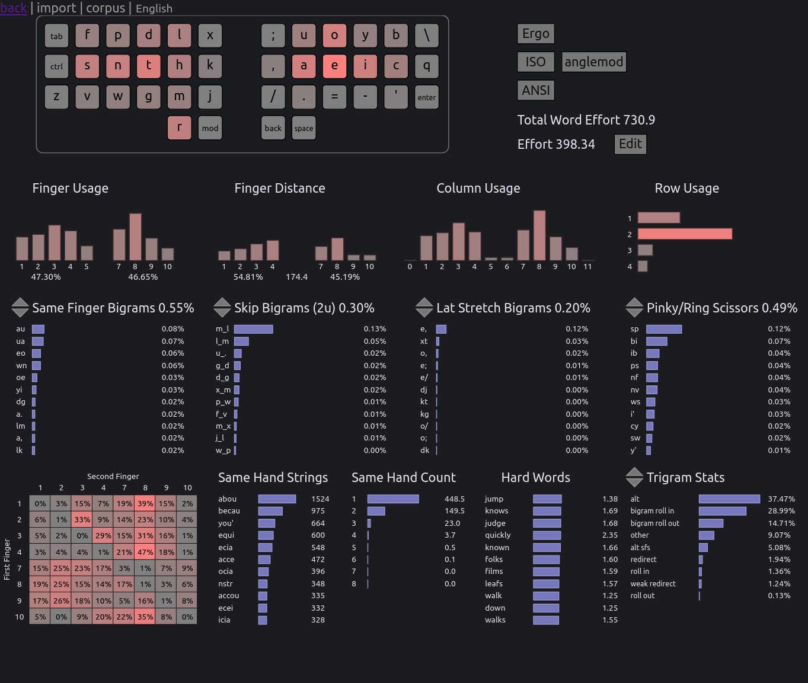
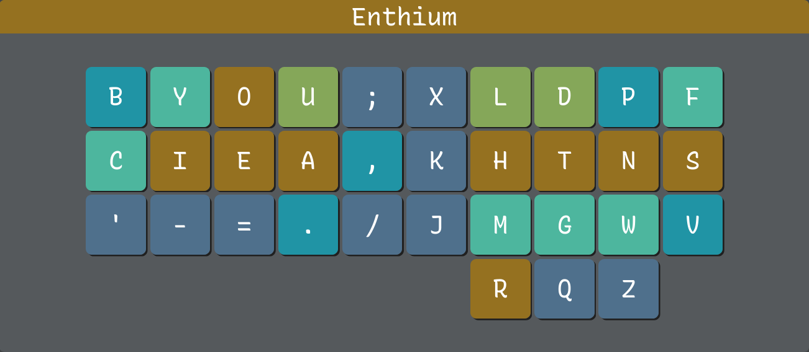
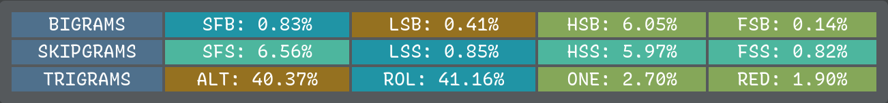
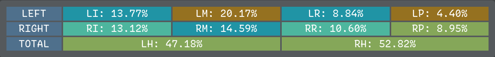
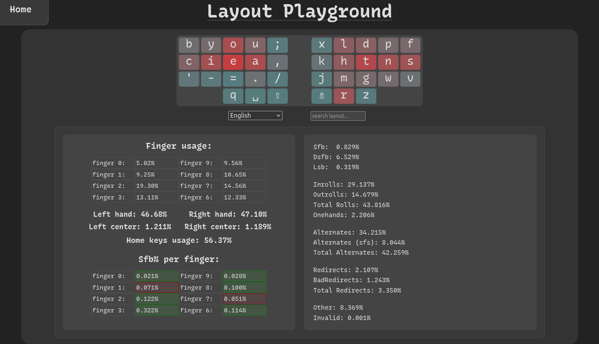

# Enthium - Engrammer meets Hands Down Promethium

This adaptation of the [Engrammer] and [Hands Down Promethium] keyboard layouts
improves on the latter's performance in keyboard layout analyzers (see below)
by mirroring it horizontally to restore familiarity with [Arno's Engram 2.0]
layout (CIEA on left hand's home row) and the [Dvorak] layout (HTNS on right
hand's home row), and by optimizing punctuation in the spirit of Engrammer.

[Hands Down Promethium]: https://reddit.com/r/KeyboardLayouts/comments/1g66ivi
[Arno's Engram 2.0]:     https://engram.dev
[Engrammer]:             https://github.com/sunaku/engrammer
[Dvorak]:                https://www.dvzine.org

## Layout

      b y o u ; x l d p f
    q c i e a , k h t n s z
      ' - = . / j m g w v
                r

## Rationale

* Q and Z are split apart onto different hands for balance and symmetry.

* Apostrophe is away (on a different finger entirely) from YOU and I so
  it can be typed without same-finger bigrams such as `you'd` and `I'd`.

* Cluster minus and equals for intuitive zoom in/out shortcuts with Ctrl.

* Cluster comma and semicolon for prev/next jumping in Vim for f/F/t/T.
  This also mirrors the relative ordering of H and L on the right hand.

* Cluster period and slash for `./` and `../` filesystem path navigation,
  raking down vertically for `</` closing tags in HTML and XML documents,
  and easy access to forward slash and question mark for Vim text search.

* Although period and comma are backwards in the sense of their shifted
  symbols `>` and `<`, their arrangement reduces lateral stretch bigrams
  and also clusters `>` with minus and equals for `->` and `=>` arrows.

## Performance

### [Cyanophage analyzer](https://cyanophage.github.io/playground.html)

Playground link:
> https://cyanophage.github.io/playground.html?layout=fpdlx%3Buoyb%5Csnthk%2Caeicqvwgmj%2F.%3D-%27zr&mode=ergo&lan=english

Overall stats:
* Total Word Effort: 730.9
* Effort:            398.34

Finger usage:
* Same Finger Bigrams: 0.55%
* Skip Bigrams (2u):   0.30%
* Lat Stretch Bigrams: 0.20%
* Pinky/Ring Scissors: 0.49%

Trigram stats:
* alt:             37.47%
* bigram roll in:  28.99%
* bigram roll out: 14.71%
* other:           9.07%
* alt sfs:         5.08%
* redirect:        1.94%
* roll in:         1.36%
* weak redirect:   1.24%
* roll out:        0.13%

### [KeySolve analyzer](https://clemenpine.github.io/keysolve-web/)

Overall stats:

    BIGRAMS     SFB: 0.83%      LSB: 0.41%      HSB: 6.05%      FSB: 0.14%
    SKIPGRAMS   SFS: 6.56%      LSS: 0.85%      HSS: 5.97%      FSS: 0.82%
    TRIGRAMS    ALT: 40.37%     ROL: 41.16%     ONE: 2.70%      RED: 1.90%

Finger usage:

    LEFT        LI: 13.77%      LM: 20.17%      LR: 8.84%       LP: 4.40%
    RIGHT       RI: 13.12%      RM: 14.59%      RR: 10.60%      RP: 8.95%
    TOTAL               LH: 47.18%                      RH: 52.82%

Custom source for copy/paste:

    b y o u ; x l d p f
    c i e a , k h t n s
    ' - = . / j m g w v
    r q z

### [Oxey's analyzer](https://oxey.dev/playground/index.html)

Overall stats:
* Sfb:              0.829%
* Dsfb:             6.529%
* Lsb:              0.319%
* Inrolls:          29.137%
* Outrolls:         14.679%
* Total Rolls:      43.816%
* Onehands:         2.206%
* Alternates:       34.215%
* Alternates (sfs): 8.044%
* Total Alternates: 42.259%
* Redirects:        2.107%
* BadRedirects:     1.243%
* Total Redirects:  3.350%
* Other:            8.369%
* Invalid:          0.001%

Finger usage:

    finger 0:   5.02%   finger 9:       9.56%
    finger 1:   9.25%   finger 8:       10.65%
    finger 2:   19.30%  finger 7:       14.56%
    finger 3:   13.11%  finger 6:       12.33%

    Left hand:   46.68% Right hand:     47.10%
    Left center: 1.211% Right center:   1.189%

    Home keys usage: 56.37%

Sfb% per finger:

    finger 0:   0.021%  finger 9:       0.028%
    finger 1:   0.071%  finger 8:       0.100%
    finger 2:   0.122%  finger 7:       0.051%
    finger 3:   0.322%  finger 6:       0.114%

## License

Public domain.

[Spare A Life]: https://sunaku.github.io/vegan-for-life.html
> Like my work? 👍 Please [spare a life] today as thanks! 🐄🐖🐑🐔🐣🐟✨🙊✌  
> Why? For 💕 ethics, the 🌎 environment, and 💪 health; see link above. 🙇
