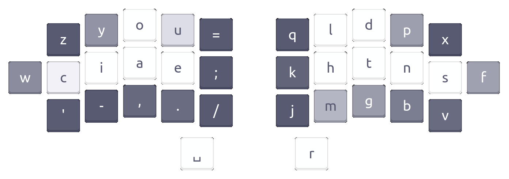
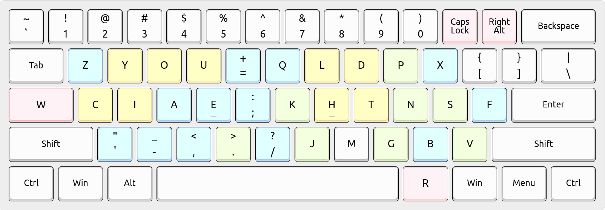

# Enthium — Engrammer meets Promethium

*Enthium* is a [highly performant] [adaptation of] the [Engrammer] and [Hands Down
Promethium] keyboard layouts.  It restores familiarity with [Arno's Engram 2.0]
layout (CIEA on the left hand) and the [Dvorak] layout (HTNS on the right hand)
while optimizing punctuation placement for programming in the spirit of Engrammer,
featuring a `,;` cluster and HJKL for Vim, `-=` for zooming, and `./` for paths.

> [0.42% SFBs, 0.15% LSBs, 0.08% scissors, 46.53% rolls, 2.18% redirects, 3.31% pinky off](#performance)

      z y u o ; q l d p x
    w c i e a , k h t n s f
      ' - = . / j m g b v
                r

[highly performant]:     #performance
[adaptation of]:         https://sunaku.github.io/enthium-keyboard-layout.html
[Hands Down Promethium]: https://reddit.com/r/KeyboardLayouts/comments/1g66ivi
[Arno's Engram 2.0]:     https://github.com/binarybottle/engram
[Engrammer]:             https://github.com/sunaku/engrammer
[Dvorak]:                https://www.dvzine.org

## Rationale

* The primary same-finger bigrams UE (0.08%), OA (0.05%), and YI (0.03%) can be
  raked down vertically, minimizing their impact on typing flow and performance.

* Pinky load is distributed by frequency: heavy letters W (1.77%) and F (2.14%)
  are close at hand on the home row's lateral pinky keys (CapsLock, Apostrophe);
  medium letters `'` (0.47%) and V (1.09%) are on the lower row pinky keys; and
  light letters Z (0.09%) and X (0.02%) are on the upper row, which all together
  help reduce strain for short pinky fingers or those [weakened by convention].

* Apostrophe is away (on a different finger entirely) from YOU and I so
  it can be typed without same-finger bigrams such as `you'd` and `I'd`.

* Minus and equals are clustered for intuitive zooming in/out with Ctrl.

* Comma and semicolon are clustered for cycling f/F/t/T searches in Vim
  and also to mirror the relative ordering of L and H on the right hand.

* Though period and comma are reversed in terms of their shifted symbols
  `>` and `<`, this arrangement helps to reduce lateral stretch bigrams
  while clustering `>` with minus and equals for `->` and `=>` arrows
  and stacking them vertically on traditional row-staggered keyboards.

[weakened by convention]: https://reddit.com/r/KeyboardLayouts/comments/1fy8nve/_/lqulnww/

## Performance

The [keyboard layout community][rKL] commonly recommends [Pascal Getreuer's
guide and comparison table][PGt] as a starting point for layout exploration,
and you'll see that Enthium is statistically among the best layouts there:

* 0.42% SFBs — wins 🥇 first place; beats the entire table!
* 0.22% _effective_ SFBs (excluding vertically rakeable ones):
  > UE (0.08%), OA (0.05%), YI (0.03%), A. (0.02%), HM (0.01%), NB (0.01%), DT (0.00%)
* 0.15% LSBs — wins 🥇 first place; beats the entire table!
* 0.08% scissors — wins 🥇 first place as a tie with Dvorak
* 46.53% rolls — beats MTGAP, Graphite, Gallium, HandsDownNeu, BEAKL19bis, Halmak
* 2.18% redirects — fourth place; surpassed by Gallium, BEAKL19bis, HandsDownNeu
* 3.31% pinky off — beats APTv3, Semimak, MTGAP, Dvorak, Recurva, Halmak, Engram

These results were [computed with Cyanophage's Layout Analyzer][cNM] as follows.

[][cNM]

[cNM]: https://cyanophage.github.io/playground.html?layout=zyuo%3Bqldpx%5Cciea%2Ckhtnsf%27-%3D.%2Fjmgbv*rw&mode=ergo&lan=english&thumb=r
[cPM]: https://cyanophage.github.io/playground.html?layout=fpdlx%3Buoybzsnthk%2Caeicqvwgmj-.%27%3D%2F%5Cr&mode=ergo&lan=english&thumb=l
[cNG]: https://cyanophage.github.io/playground.html?layout=byou%27%3Bldwvzciea%2C.htsnqgxjk-%2Frmfp%5C%5E&mode=ergo&lan=english&thumb=l
[cDV]: https://cyanophage.github.io/playground.html?layout=%27%2C.pyfgcrl%2Faoeuidhtns-%3Bqjkxbmwvz%5C%5E&mode=ergo&lan=english&thumb=l
[cCD]: https://cyanophage.github.io/playground.html?layout=qwfpbjluy%3B-arstgmneio%27zxcdvkh%2C.%2F%5C%5E&mode=ergo&lan=english&thumb=l
[cQW]: https://cyanophage.github.io/playground.html?layout=qwertyuiop-asdfghjkl%3B%27zxcvbnm%2C.%2F%5C%5E&mode=ergo&lan=english&thumb=l

| Category  | Statistic           | *[Enthium][cNM]* | [Promethium][cPM] | [Engrammer][cNG] | [Dvorak][cDV] | [Colemak-DH][cCD] | [QWERTY][cQW] |
| --------- | ------------------- | ---------------- | ----------------- | ---------------- | ------------- | ----------------- | ------------- |
| Summary   | Total Word Effort   | *723.4*          | 732.1             | 899.5            | 1185.5        | 1047.9            | 2070.6        |
| Summary   | Effort              | *455.74*         | 398.09            | 457.41           | 769.69        | 534.99            | 1258.15       |
| Bigrams   | Same Finger Bigrams | *0.42%*          | 0.58%             | 0.99%            | 1.87%         | 0.91%             | 4.38%         |
| Bigrams   | Skip Bigrams (2u)   | *0.32%*          | 0.36%             | 0.39%            | 0.45%         | 0.41%             | 1.43%         |
| Bigrams   | Lat Stretch Bigrams | *0.15%*          | 0.24%             | 0.41%            | 0.80%         | 1.27%             | 4.55%         |
| Bigrams   | Scissors            | *0.08%*          | 0.11%             | 0.36%            | 0.08%         | 0.15%             | 1.46%         |
| Trigrams  | Alt                 | *37.29%*         | 36.98%            | 35.62%           | 39.08%        | 25.43%            | 21.38%        |
| Trigrams  | Alt SFS             | *4.43%*          | 5.27%             | 5.93%            | 5.85%         | 5.47%             | 5.42%         |
| Trigrams  | Roll in             | *0.87%*          | 1.72%             | 1.82%            | 0.28%         | 1.50%             | 1.32%         |
| Trigrams  | Roll out            | *0.35%*          | 0.29%             | 0.29%            | 0.27%         | 0.98%             | 1.48%         |
| Trigrams  | Bigram roll in      | *28.58%*         | 29.17%            | 28.14%           | 23.51%        | 25.18%            | 20.38%        |
| Trigrams  | Bigram roll out     | *16.73%*         | 14.56%            | 14.03%           | 15.14%        | 21.54%            | 17.58%        |
| Trigrams  | Redirect            | *2.18%*          | 1.53%             | 2.26%            | 1.55%         | 5.33%             | 6.22%         |
| Trigrams  | Weak redirect       | *0.82%*          | 0.87%             | 0.74%            | 0.64%         | 1.09%             | 0.44%         |
| Trigrams  | Other               | *8.76%*          | 9.61%             | 11.17%           | 13.68%        | 13.49%            | 25.78%        |
| Computed  | Pinky off           | *3.31%*          | 4.08%             | 5.70%            | 4.13%         | 0.78%             | 2.47%         |

[rKL]: https://www.reddit.com/r/KeyboardLayouts/
[PGt]: https://getreuer.info/posts/keyboards/alt-layouts/index.html#which-alt-keyboard-layout-should-i-learn

## Installation

### Linux setup

>*Legend:* QWERTY=white, Engram=yellow, Promethium=green, Enthium=blue, Quirks=pink.
>

Install:

    cd linux/
    sudo make install
    echo Now restart your graphical session.

Activate:

    setxkbmap -layout us    -variant enthium         # one layout; no switch
    setxkbmap -layout us,us -variant enthium,basic   # dual layout switching

Repair (e.g. whenever a system-wide XKB package upgrade reverts installation):

    cd linux/
    sudo make reinstall
    echo Now restart your graphical session.

Uninstall:

    cd linux/
    sudo make uninstall
    echo Now restart your graphical session.

### MacOS setup

Install:

* You'll need [Karabiner-Elements], which is also available in [Homebrew]:

      brew install --cask karabiner-elements

Activate:

* Use the [complex modification feature for Enthium][KeNM] to remap your keys.

  (Note: The latest version of this is [available here in this Git repository](macos/karabiner.json).)

Uninstall:

* Remove the complex modification feature for Enthium that you activated.

* Optionally remove Karabiner-Elements, which can be done with Homebrew:

      brew uninstall --cask karabiner-elements

[KeNM]: https://ke-complex-modifications.pqrs.org/?q=enthium
[Karabiner-Elements]: https://karabiner-elements.pqrs.org
[Homebrew]: https://brew.sh

## License

Released under the same terms as [Arno's Engram 2.0] keyboard layout's sources:

> MIT License
>
> Copyright 2022 Ricard Figueroa <https://github.com/rfiga>  
> Copyright 2021 Suraj N. Kurapati <https://github.com/sunaku>  
> Copyright 2021 Arno Klein <https://github.com/binarybottle>  
>
> Permission is hereby granted, free of charge, to any person obtaining a copy
> of this software and associated documentation files (the "Software"), to deal
> in the Software without restriction, including without limitation the rights
> to use, copy, modify, merge, publish, distribute, sublicense, and/or sell
> copies of the Software, and to permit persons to whom the Software is
> furnished to do so, subject to the following conditions:
>
> The above copyright notice and this permission notice shall be included in
> all copies or substantial portions of the Software.
>
> THE SOFTWARE IS PROVIDED "AS IS", WITHOUT WARRANTY OF ANY KIND, EXPRESS OR
> IMPLIED, INCLUDING BUT NOT LIMITED TO THE WARRANTIES OF MERCHANTABILITY,
> FITNESS FOR A PARTICULAR PURPOSE AND NONINFRINGEMENT. IN NO EVENT SHALL THE
> AUTHORS OR COPYRIGHT HOLDERS BE LIABLE FOR ANY CLAIM, DAMAGES OR OTHER
> LIABILITY, WHETHER IN AN ACTION OF CONTRACT, TORT OR OTHERWISE, ARISING FROM,
> OUT OF OR IN CONNECTION WITH THE SOFTWARE OR THE USE OR OTHER DEALINGS IN THE
> SOFTWARE.

---------------------------------------------------------------------------
[Spare A Life]: https://sunaku.github.io/vegan-for-life.html
> Like my work? 👍 Please [spare a life] today as thanks! 🐄🐖🐑🐔🐣🐟✨🙊✌  
> Why? For 💕 ethics, the 🌎 environment, and 💪 health; see link above. 🙇
