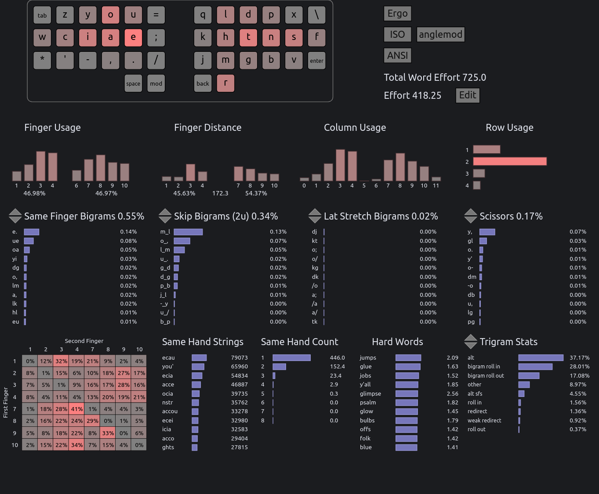

# Enthium v13 — Engrammer meets Promethium

*Enthium* is a highly performant adaptation of the [Engrammer] and [Hands Down
Promethium] keyboard layouts.  It restores familiarity with [Arno's Engram 2.0]
layout (YOU on the left hand) and the [Dvorak] layout (HTNS on the right hand)
while optimizing punctuation placement for programming in the spirit of Engrammer,
featuring HJKL and `,;` for Vim, `-=` for zooming, and `./` for filesystem paths.

      q y o u = x l d p z
    b c i a e - k h t n s w
      ' , . / ; j m g f v
                r

[Hands Down Promethium]: https://reddit.com/r/KeyboardLayouts/comments/1g66ivi
[Arno's Engram 2.0]:     https://github.com/binarybottle/engram
[Engrammer]:             https://github.com/sunaku/engrammer
[Dvorak]:                https://www.dvzine.org

## Rationale

* Pinky load is stratified by frequency: heavy letters B (1.44%) and W (1.77%)
  are close to home position on the lateral pinky keys (CapsLock, Apostrophe);
  medium letters `'` (0.47%) and V (1.09%) occupy the lower row pinky keys; and
  light letters Q (0.10%) and Z (0.09%) sit on the upper row.  This distribution
  helps reduce strain for short pinky fingers or those [weakened by convention].

* Vertical same-finger bigrams such as UE (0.08%), OA (0.05%), and NF (0.04%)
  can be _raked down_, mitigating their impact on typing flow and performance.
  Similarly, horizontal ones can be _slid over_ based on dexterity and comfort.

* Apostrophe is on a different finger from vowels to avoid same-finger bigrams
  when typing contractions in English: You'd, I'd, He'd, They'd, Quo's, Via's.

* B/E/W, I/A, K/J, Ctrl-P/N, T/F, and `,;` are directionally coherent for Vim.

* Ctrl-B/I/U shortcuts for bold/italic/underline are all on the same hand.

* `-` and `=` are clustered for intuitive zoom-in/out shortcuts with Ctrl.

* `.` and `/` are clustered for relative `./` and `../` filesystem paths.

* `,./` are in the same sequence as QWERTY for easier adaptation, especially
  for navigation and custom application shortcuts that rely on shifted `<>`.

* `',.` are on the same fingers and hand (only the row changes) as Dvorak.

* See [my blog post] for a closer look at Enthium's design and evolution.

[my blog post]:           https://sunaku.github.io/enthium-keyboard-layout.html
[weakened by convention]: https://reddit.com/r/KeyboardLayouts/comments/1fy8nve/_/lqulnww/

## Performance

The [keyboard layout community][rKL] commonly recommends [Pascal Getreuer's
guide][PGr] and ranking tables as a starting point for layout exploration,
and Enthium ranks among the top-performing layouts there as of 2025-12-22.
More importantly, Enthium is well-balanced in terms of ergonomic concerns
(same-finger avoidance, redirects, rolls, and pinky load) for sustained use.

Comparing with [conventional layout rankings][PGl]:

* 0.55% SFBs — second 🥈 place; only surpassed by Focal
* 2.67% SFSs — first 🥇 place; beats the entire table!
* 0.07% LSBs — first 🥇 place; beats the entire table!
* 1.48% redirects — second 🥈 place; after HandsDownNeu
* 0.16% scissors — sixth place; after Dvorak, Anymak:END, APTv3, MTGAP, Colemak-DH
* 45.82% rolls — beats Semimak, Engram, HandsDownNeu, Anymak:END, Halmak, Dvorak
* 2.91% pinky off — beats Canary, Gallium, APTv3, Semimak, MTGAP, Dvorak, Recurva, etc.

Comparing with [thumb-letter layout rankings][PGt]:

* 0.55% SFBs — second 🥈 place; only surpassed by Night
* 2.67% SFSs — second 🥈 place; only surpassed by Night
* 0.07% LSBs — second 🥈 place; only surpassed by Caster
* 1.48% redirects — third 🥉 place; after Nordrassil, Vibranium
* 0.16% scissors — fourth place; after RSTHD, Promethium, Maltron
* 45.82% rolls — sixth place; beats Promethium, Nordrassil
* 2.91% pinky off — third 🥉 place; after RSTHD, Nordrassil

Several same-finger bigrams (SFBs) in Enthium can be _raked down_ vertically
across adjacent rows or _slid over_ horizontally, based on your dexterity and
comfort.  This allows the same finger to actuate both keys in one continuous
motion, thereby mitigating their impact on your typing flow and performance:

> 0.55% SFBs - 0.26% rakeable - 0.07% slideable = **0.22% _effective_ SFBs**

| SFB  | Cost  | Mitigation |
| ---  | ----  | ---------- |
| `ue` | 0.08% | rake down  |
| `oa` | 0.05% | rake down  |
| `nf` | 0.04% | rake down  |
| `ws` | 0.03% | slide in   |
| `yi` | 0.03% | rake down  |
| `e-` | 0.02% | slide out  |
| `sw` | 0.02% | slide out  |
| `a.` | 0.02% | rake down  |
| `lk` | 0.02% | rake down  |
| `e/` | 0.01% | rake down  |
| `hm` | 0.01% | rake down  |

These results were [computed with Cyanophage's Layout Analyzer][cNM] as follows.

[][cNM]

[cNM]: https://cyanophage.github.io/playground.html?layout=qyou%3Dxldpz%5Cciae-khtnsw%27%2C.%2F%3Bjmgfv*rb&mode=ergo&lan=english&thumb=r
[cPM]: https://cyanophage.github.io/playground.html?layout=fpdlx%3Buoybzsnthk%2Caeicqvwgmj-.%27%3D%2F%5Cr&mode=ergo&lan=english&thumb=l
[cNG]: https://cyanophage.github.io/playground.html?layout=byou%27%3Bldwvzciea%2C.htsnqgxjk-%2Frmfp%5C%5E&mode=ergo&lan=english&thumb=l
[cDV]: https://cyanophage.github.io/playground.html?layout=%27%2C.pyfgcrl%2Faoeuidhtns-%3Bqjkxbmwvz%5C%5E&mode=ergo&lan=english&thumb=l
[cCD]: https://cyanophage.github.io/playground.html?layout=qwfpbjluy%3B-arstgmneio%27zxcdvkh%2C.%2F%5C%5E&mode=ergo&lan=english&thumb=l
[cQW]: https://cyanophage.github.io/playground.html?layout=qwertyuiop-asdfghjkl%3B%27zxcvbnm%2C.%2F%5C%5E&mode=ergo&lan=english&thumb=l

| Category | Statistic              | [Enthium][cNM] | [Promethium][cPM] | [Engrammer][cNG] | [Dvorak][cDV] | [Colemak-DH][cCD] | [QWERTY][cQW] |
| -------- | ---------------------- | -------------- | ----------------- | ---------------- | ------------- | ----------------- | ------------- |
| Summary  | Total Word Effort 📉   | 724.5          | 732.1             | 899.5            | 1185.5        | 1047.9            | 2070.6        |
| Summary  | Effort 📉              | 416.42         | 398.09            | 457.41           | 769.69        | 534.99            | 1258.15       |
| Bigrams  | Same Finger Bigrams 📉 | 0.55%          | 0.58%             | 0.99%            | 1.87%         | 0.91%             | 4.38%         |
| Bigrams  | Skip Bigrams (2u) 📉   | 0.33%          | 0.36%             | 0.39%            | 0.45%         | 0.49%             | 1.43%         |
| Bigrams  | Skip Bigrams (SFS) 📉  | 2.67%          | 3.05%             | 3.47%            | 3.48%         | 4.24%             | 5.45%         |
| Bigrams  | Lat Stretch Bigrams 📉 | 0.07%          | 0.24%             | 0.41%            | 0.80%         | 1.27%             | 4.55%         |
| Bigrams  | Scissors 📉            | 0.16%          | 0.11%             | 0.36%            | 0.08%         | 0.15%             | 1.46%         |
| Trigrams | Alt 📈                 | 38.09%         | 36.98%            | 35.62%           | 39.08%        | 25.43%            | 21.38%        |
| Trigrams | Alt SFS 📉             | 4.46%          | 5.27%             | 5.93%            | 5.85%         | 5.47%             | 5.42%         |
| Trigrams | Roll in 📈             | 1.55%          | 1.72%             | 1.82%            | 0.28%         | 1.50%             | 1.32%         |
| Trigrams | Roll out 📈            | 0.40%          | 0.29%             | 0.29%            | 0.27%         | 0.98%             | 1.48%         |
| Trigrams | Bigram roll in 📈      | 26.99%         | 29.17%            | 28.14%           | 23.51%        | 25.18%            | 20.38%        |
| Trigrams | Bigram roll out 📈     | 16.88%         | 14.56%            | 14.03%           | 15.14%        | 21.54%            | 17.58%        |
| Trigrams | Redirect 📉            | 1.48%          | 1.53%             | 2.26%            | 1.55%         | 5.33%             | 6.22%         |
| Trigrams | Weak redirect 📉       | 0.79%          | 0.87%             | 0.74%            | 0.64%         | 1.09%             | 0.44%         |
| Trigrams | Other 📉               | 9.36%          | 9.61%             | 11.17%           | 13.68%        | 13.49%            | 25.78%        |
| Computed | Pinky off 📉           | 2.91%          | 4.08%             | 5.70%            | 4.13%         | 0.78%             | 2.47%         |

[rKL]: https://www.reddit.com/r/KeyboardLayouts/
[PGr]: https://getreuer.info/posts/keyboards/alt-layouts/
[PGl]: https://getreuer.info/posts/keyboards/alt-layouts/#which-alt-keyboard-layout-should-i-learn
[PGt]: https://getreuer.info/posts/keyboards/alt-layouts/#layouts-with-thumb-keys

## Implementation

### Row-staggered keyboards

### Split/columnar keyboards

See my [Glorious Engrammer] keymap:

[Glorious Engrammer]: https://github.com/sunaku/glove80-keymaps

## Installation

### Linux setup

Install:

    cd linux/
    sudo make install
    echo Now restart your graphical session.

Activate:

    setxkbmap -layout us    -variant enthium         # one layout; no switch
    setxkbmap -layout us,us -variant enthium,basic   # dual layout switching

Repair (e.g. whenever a system-wide XKB package upgrade reverts installation):

    cd linux/
    sudo make reinstall
    echo Now restart your graphical session.

Uninstall:

    cd linux/
    sudo make uninstall
    echo Now restart your graphical session.

### MacOS setup

Install:

* You'll need [Karabiner-Elements], which is also available in [Homebrew]:

      brew install --cask karabiner-elements

Activate:

* Use the [complex modification feature for Enthium][KeNM] to remap your keys.

  (Note: The latest version of this is [available here in this Git repository](macos/karabiner.json).)

Uninstall:

* Remove the complex modification feature for Enthium that you activated.

* Optionally remove Karabiner-Elements, which can be done with Homebrew:

      brew uninstall --cask karabiner-elements

[KeNM]: https://ke-complex-modifications.pqrs.org/?q=enthium
[Karabiner-Elements]: https://karabiner-elements.pqrs.org
[Homebrew]: https://brew.sh

## License

Released under the same terms as [Arno's Engram 2.0] keyboard layout's sources:

> MIT License
>
> Copyright 2022 Ricard Figueroa <https://github.com/rfiga>  
> Copyright 2021 Suraj N. Kurapati <https://github.com/sunaku>  
> Copyright 2021 Arno Klein <https://github.com/binarybottle>  
>
> Permission is hereby granted, free of charge, to any person obtaining a copy
> of this software and associated documentation files (the "Software"), to deal
> in the Software without restriction, including without limitation the rights
> to use, copy, modify, merge, publish, distribute, sublicense, and/or sell
> copies of the Software, and to permit persons to whom the Software is
> furnished to do so, subject to the following conditions:
>
> The above copyright notice and this permission notice shall be included in
> all copies or substantial portions of the Software.
>
> THE SOFTWARE IS PROVIDED "AS IS", WITHOUT WARRANTY OF ANY KIND, EXPRESS OR
> IMPLIED, INCLUDING BUT NOT LIMITED TO THE WARRANTIES OF MERCHANTABILITY,
> FITNESS FOR A PARTICULAR PURPOSE AND NONINFRINGEMENT. IN NO EVENT SHALL THE
> AUTHORS OR COPYRIGHT HOLDERS BE LIABLE FOR ANY CLAIM, DAMAGES OR OTHER
> LIABILITY, WHETHER IN AN ACTION OF CONTRACT, TORT OR OTHERWISE, ARISING FROM,
> OUT OF OR IN CONNECTION WITH THE SOFTWARE OR THE USE OR OTHER DEALINGS IN THE
> SOFTWARE.

---------------------------------------------------------------------------
[Spare A Life]: https://sunaku.github.io/vegan-for-life.html
> Like my work? 👍 Please [spare a life] today as thanks! 🐄🐖🐑🐔🐣🐟✨🙊✌  
> Why? For 💕 ethics, the 🌎 environment, and 💪 health; see link above. 🙇
